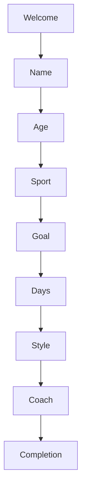

# Product Requirements Document (PRD) for /barefootweb Project

## 1. Introduction

### Project Overview
The /barefootweb project is a web application designed to help users improve their foot health and athletic performance through personalized workout programs. It features user onboarding, workout tracking, streaks, badges, and integrates with Supabase for authentication and data management.

### Goals and Objectives
- Provide a seamless onboarding experience to personalize user programs.
- Track user workouts, progress, and streaks.
- Reward users with badges for milestones and achievements.
- Use Supabase for secure authentication and data storage.
- Deliver a modern, responsive, and engaging UI.

---

## 2. User Onboarding Flow

### Onboarding Steps
- **Welcome:** Introduction and motivation.
- **Name:** Collect user name.
- **Age:** Select age bracket.
- **Sport:** Choose primary sport or activity.
- **Goal:** Define main goal with Barefoot.
- **Days:** Weekly commitment.
- **Style:** Preferred learning style.
- **Coach:** Informational step about personalized program.

### Data Collected
- Name
- Age Bracket
- Favorite Sport
- Primary Goal
- Weekly Commitment
- Learning Style

### Profile Update
User answers are saved to the Supabase `profiles` table, marking onboarding as complete.

### UI and Animations
- Glassmorphic card style with gradient backgrounds.
- Animated buttons using Framer Motion.
- Progress bars indicating onboarding progress.
- Mascot animations for engagement.

### Onboarding Flow Diagram

---

## 3. Pages and Their Functions

- **AccountPage:** Manage user account details.
- **AthleteDashboard:** Main dashboard showing workouts, progress, streaks.
- **BadgesPage:** Display earned badges and badges to earn.
- **HelpPage:** User help and support resources.
- **Index:** Landing or home page.
- **Login:** User authentication.
- **NotFound:** 404 error page.
- **NotificationsPage:** User notifications management.
- **ParentDashboard:** Dashboard for parents (if applicable).
- **ProgressPage:** Detailed progress tracking.
- **SettingsPage:** User preferences and settings.
- **WorkoutPage:** Workout details and tracking.
- **OnboardingPage:** New user onboarding flow.

---

## 4. Streaks Feature

### Description
Tracks the number of consecutive days a user completes workouts to encourage consistency.

### UI Components
- **StreakTracker:** Displays current streak with calendar icon, tooltip, and motivational text.
- Gradient background with white text for visibility.

### Integration
- Uses workout context to fetch current streak.
- Displayed prominently on AthleteDashboard.

---

## 5. Badges System

### Badge Tiers and Categories
- Tiers: Bronze, Silver, Gold.
- Categories: Milestone, Mobility, Streak, Coordination, Strength, Balance, Phases, Weekly, Consistency.

### Badge Definitions
- Examples: "First Step," "Flex Master," "Streak King," "Completionist," "7-Day Beast," etc.
- Each badge has a name, description, icon, tier, and category.

### UI Components
- **BadgeCard:** Displays individual badge with icon, name, description, and lock if locked.
- **BadgesToEarn:** Lists badges users can aim to earn with requirements.

### Badge Earning Logic
- Stored in Supabase `user_badges` table with earned date.
- Badges unlocked based on workout completion and streaks.

---

## 6. Supabase Integration

### Client Setup
- Supabase client initialized with project URL and public key.
- Typed with Database schema for type safety.

### Authentication
- Uses Supabase auth with custom `useAuth` hook.
- Stores user metadata including name.

### Profile Management
- Onboarding updates user profile in `profiles` table.
- Tracks onboarding completion status.

### Badges and User Badges
- `badges` table stores badge metadata.
- `user_badges` table tracks badges earned by users.

---

## 7. Design Specifications

### UI Style
- Glassmorphic cards with semi-transparent backgrounds and blur.
- Gradient backgrounds and buttons with smooth animations.
- Use of shadcn/ui components for consistent UI elements.
- Icons from lucide-react for visual clarity.
- Responsive layouts with Tailwind CSS.
- Accessibility considerations with labels and keyboard navigation.

### Animations
- Framer Motion for button hover and tap effects.
- Mascot animations for onboarding engagement.

---

## 8. Onboarding Flow Diagram

---

## 9. Summary and Next Steps

- The /barefootweb project provides a comprehensive platform for foot health workouts with personalized onboarding, progress tracking, streaks, and badges.
- Supabase integration ensures secure and scalable backend services.
- The UI is modern, engaging, and accessible.
- Next steps include detailed workout tracking documentation, notification system design, and further UI polish.

---

End of PRD for /barefootweb project.